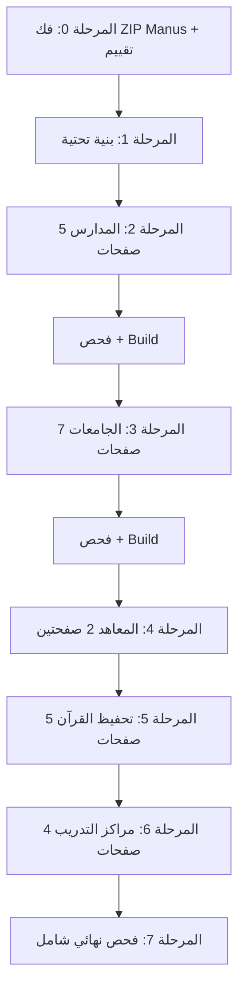

## التقييم الصادق لتسليم المطور الثاني (Manus)

### المشاكل المكتشفة

#### 1. الألوان كلها **خاطئة** — لا تطابق التصاميم الأصلية

| المؤسسة | لون Manus (خاطئ) | اللون الأصلي من HTML | الفرق |
|---|---|---|---|
| **الجامعة** | `#8B5CF6` (بنفسجي) | `#1A56DB` (أزرق غامق) | لون مختلف تماماً |
| **المدرسة** | `#3B82F6` (أزرق Tailwind) | `#1E88E5` / `#0D47A1` (أزرق Material) | قريب لكن خاطئ |
| **المعهد** | `#10B981` (أخضر) | `#0EA5E9` (أزرق سماوي) | لون مختلف تماماً |
| **مركز القرآن** | `#EF4444` (أحمر) | `#047857` (أخضر زمردي) | **عكس تماماً!** |
| **مركز التدريب** | `#F59E0B` (عنبري) | `#E65100` (برتقالي غامق) | لون مختلف |

> **الخلاصة**: ادعاء "دقة بصرية 100%" **غير صحيح**. كل الألوان الخمسة لا تطابق التصاميم الأصلية.

#### 2. ملفات مفقودة في المشروع الحالي
- `InstitutionLayout.tsx` — **غير موجود** (Manus يدّعي أنه موجود)
- `routing.ts` — **غير موجود**
- `src/hooks/` — **مجلد غير موجود**
- `src/services/` — **مجلد غير موجود**
- `src/components/ui/` — **مجلد غير موجود**
- `InstituteTemplate.tsx` — **غير موجود** (فقط 4 templates)

#### 3. الـ ZIP لم يُفكّ بعد
- حجمه 3.4MB لكن ما ندري إذا الكود قابل للدمج المباشر أو لا
- يحتوي على `.bak` و `.backup` files (ملفات نسخ احتياطية) — يحتاج تنظيف

#### 4. ما هو صالح من تسليم Manus (محتمل)
- **هيكل UI Components** (Button, Card, StatCard, Table, Badge) — مفيد كأساس
- **مفهوم Smart Routing** — فكرة جيدة لكن تحتاج تطبيق بألوان صحيحة
- **Hooks** (useInstitution, useDashboard) — مفيدة إذا كانت متوافقة مع APIs الموجودة
- **dashboardService.ts** — قد يكون مفيد كنقطة بداية

---

## الوضع الحالي للمشروع

### الصفحات الموجودة مقارنة بالتصاميم

| الصفحة | موجودة | أسطر حالياً | أسطر التصميم | الفجوة |
|---|---|---|---|---|
| SchoolTemplate (Landing) | نعم | 119 | 1,218 | **-1,099** |
| UniversityTemplate (Landing) | نعم | 142 | 1,207 | **-1,065** |
| QuranTemplate (Landing) | نعم | 144 | 388 | **-244** |
| TrainingTemplate (Landing) | نعم | 148 | 387 | **-239** |
| InstituteTemplate (Landing) | **لا** | 0 | 964 | **-964** |
| school-owner | نعم | 552 | 738 | **-186** |
| teacher | نعم | 451 | 836 | **-385** |
| parent | نعم | 333 | 795 | **-462** |
| staff (HR) | نعم | 260 | 661 | **-401** |
| university-owner | نعم | 390 | 913 | **-523** |
| colleges (عميد) | نعم | 462 | 749 | **-287** |
| student | نعم | 419 | 620 | **-201** |
| admin | نعم | 535 | 535 | **0** |
| institute-owner | نعم | 384 | 855 | **-471** |
| muhaffiz | نعم | 196 | 226 | **-30** |
| supervisor | نعم | 174 | 361 | **-187** |
| live-quran | نعم | 261 | 427 | **-166** |
| training-owner | نعم | 408 | 396 | +12 |
| trainer | نعم | 197 | 345 | **-148** |
| trainee | نعم | 156 | 386 | **-230** |

### الألوان الصحيحة (من التصاميم الأصلية)

**الثيم الأساسي المشترك:**
- خلفية: `#06060E`
- نص: `#EEEEF5`
- ذهبي (ماتين): `#D4A843`

**ألوان المؤسسات:**
- جامعة: `--uni-primary: #1A56DB`, `--uni-secondary: #1E3A8A`, accent `#F59E0B`
- مدرسة: `--school-primary: #1E88E5`, `--school-secondary: #0D47A1`, accent `#FFB300`
- معهد: `--inst-p: #0EA5E9`, `--inst-s: #0369A1`, accent `#F59E0B`
- قرآن: `--qr-primary: #047857`, `--qr-secondary: #065F46`, accent `#D4A843`
- تدريب: `--center-primary: #E65100`, `--center-secondary: #BF360C`, accent `#FF6D00`

---

## خطة التنفيذ الشاملة

### المرحلة 0: فك وتقييم حزمة Manus

#### 0.1 فك الـ ZIP
- فك `matin_rakaan_final_delivery.zip` إلى مجلد مؤقت `_manus_delivery/`
- **لا ندمج مباشرة** — نفحص أولاً

#### 0.2 فحص جودة الكود
- قراءة كل ملف من ملفات Manus (Templates, UI, Hooks, Services, Routing)
- مقارنة مع التصاميم الأصلية HTML
- تحديد ما هو صالح للاستخدام وما يحتاج إعادة كتابة

#### 0.3 قرار الدمج
- إذا كود Manus **جيد بنيوياً** → نأخذ الهيكل ونصلح الألوان والمحتوى
- إذا كود Manus **سطحي/ناقص** → نبني من الصفر بناءً على HTML الأصلي
- **في كلتا الحالتين**: التصميم النهائي يجب أن يطابق HTML الأصلي حرفياً

---

### المرحلة 1: البنية التحتية المشتركة

#### 1.1 إنشاء الملفات الأساسية المفقودة
- `src/components/ui/` — Button, Card, StatCard, Table, Badge (من Manus أو جديد)
- `src/hooks/useInstitution.ts` — إدارة بيانات المؤسسة
- `src/hooks/useDashboard.ts` — إدارة بيانات لوحة التحكم
- `src/services/dashboardService.ts` — خدمة API
- `src/lib/routing.ts` — خريطة التوجيه
- `src/components/layouts/InstitutionLayout.tsx` — موزع القوالب

#### 1.2 تصحيح الألوان
- تحديث كل template بالألوان **الصحيحة** من التصاميم الأصلية
- التأكد أن الخلفية `#06060E` في كل الصفحات (مش `#0A0F1C`)

---

### المرحلة 2: المدارس (5 صفحات)

| # | الصفحة | المصدر HTML | الهدف TSX |
|---|---|---|---|
| 2.1 | Landing Page | `بوابة المدرسة.html` (1,218 سطر) | `SchoolTemplate.tsx` |
| 2.2 | مالك المدرسة | `لوحة مالك المدرسة.html` (738 سطر) | `school-owner/page.tsx` |
| 2.3 | المعلم | `لوحة المعلم.html` (836 سطر) | `teacher/page.tsx` |
| 2.4 | ولي الأمر | `بوابة ولي الأمر.html` (795 سطر) | `parent/page.tsx` |
| 2.5 | الموارد البشرية | `الموارد البشرية.html` (661 سطر) | `staff/page.tsx` |

**بعد الانتهاء**: `npm run build` + فحص بصري → ثم المرحلة 3

---

### المرحلة 3: الجامعات (7 صفحات)

| # | الصفحة | أسطر HTML | الهدف TSX |
|---|---|---|---|
| 3.1 | Landing | 1,207 | `UniversityTemplate.tsx` |
| 3.2 | رئيس الجامعة | 913 | `university-owner/page.tsx` |
| 3.3 | عميد الكلية | 749 | `colleges/page.tsx` |
| 3.4 | هيئة التدريس | 966 | صفحة جديدة أو تعديل `teacher/page.tsx` |
| 3.5 | الطالب | 620 | `student/page.tsx` |
| 3.6 | ولي الأمر الجامعي | 749 | `parent/page.tsx` (بحسب نوع المؤسسة) |
| 3.7 | الموظفين الإداريين | 535 | `admin/page.tsx` |

---

### المرحلة 4: المعاهد (2 صفحتين)

| # | الصفحة | أسطر | الهدف |
|---|---|---|---|
| 4.1 | Landing | 964 | `InstituteTemplate.tsx` (**ملف جديد**) |
| 4.2 | مدير المعهد | 855 | `institute-owner/page.tsx` |

---

### المرحلة 5: تحفيظ القرآن (5 صفحات)

| # | الصفحة | أسطر | الهدف |
|---|---|---|---|
| 5.1 | Landing | 388 | `QuranTemplate.tsx` |
| 5.2 | المحفّظ | 226 | `muhaffiz/page.tsx` |
| 5.3 | المشرف | 361 | `supervisor/page.tsx` |
| 5.4 | الطالب وولي الأمر | 424 | صفحة مخصصة |
| 5.5 | الحلقة المباشرة | 427 | `live-quran/page.tsx` + خط Amiri Quran |

---

### المرحلة 6: مراكز التدريب (4 صفحات)

| # | الصفحة | أسطر | الهدف |
|---|---|---|---|
| 6.1 | Landing | 387 | `TrainingTemplate.tsx` |
| 6.2 | مدير المركز | 396 | `training-owner/page.tsx` |
| 6.3 | المدرب | 345 | `trainer/page.tsx` |
| 6.4 | المتدرب | 386 | `trainee/page.tsx` |

---

### المرحلة 7: فحص نهائي شامل
- `npm run build` — تأكد من نجاح البناء (233+ صفحة)
- فحص بصري لكل صفحة على السيرفر
- مقارنة كل صفحة مع HTML الأصلي
- التأكد من عمل APIs الديناميكية
- PM2 logs بدون أخطاء

---

## آلية العمل لكل صفحة

```
1. قراءة HTML التصميمي كاملاً
2. قراءة الصفحة الحالية في المشروع
3. تحويل HTML → TSX:
   - class → className
   - style="..." → style={{...}}
   - onclick → onClick
   - for → htmlFor
   - 'use client' + dynamic imports حسب الحاجة
4. ربط ديناميكي:
   - بيانات ثابتة → useState + useEffect + fetch()
   - ربط بـ APIs الموجودة (195 API)
5. npm run build → إصلاح أي خطأ
6. رفع للسيرفر + PM2 restart
```

---

## معايير القبول (Definition of Done)

**لكل صفحة:**
- [ ] التصميم يطابق HTML الأصلي (ألوان حقيقية، ليس ألوان Manus)
- [ ] خلفية `#06060E` + نص `#EEEEF5` + ذهبي `#D4A843`
- [ ] البيانات ديناميكية من API
- [ ] لا أخطاء في الكونسول
- [ ] `npm run build` ناجح

**للمشروع ككل:**
- [ ] 24 صفحة منفّذة
- [ ] Build ناجح
- [ ] PM2 شغال بدون أخطاء
- [ ] كل الألوان من التصاميم الأصلية وليس من تقرير Manus

---

## ترتيب التنفيذ


